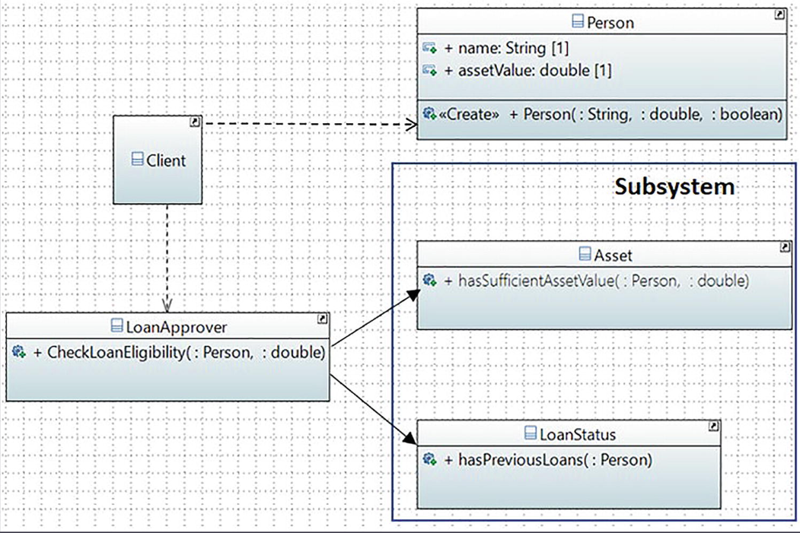

# Patrón de Diseño Facade en Java

Este proyecto es una implementación clara y didáctica del patrón de diseño **Facade** (Fachada). El objetivo es demostrar cómo este patrón proporciona una interfaz unificada y simplificada para un conjunto de interfaces en un subsistema complejo, facilitando su uso y reduciendo el acoplamiento entre el cliente y el sistema.

## Problema Abordado: Complejidad en el Subsistema

Imaginemos un sistema para la aprobación de préstamos. Para determinar si un solicitante es elegible, se deben realizar múltiples verificaciones en diferentes módulos o subsistemas:
1.  **Verificación de Activos**: ¿El valor de los activos del solicitante es suficiente para cubrir el monto del préstamo?
2.  **Verificación de Historial Crediticio**: ¿El solicitante tiene préstamos previos pendientes?

Un cliente que necesite realizar esta operación tendría que conocer y interactuar directamente con cada uno de estos subsistemas, entender su lógica y orquestar las llamadas en el orden correcto. Esto genera un alto acoplamiento y hace que el código del cliente sea complejo y difícil de mantener.

## Solución: El Patrón Facade

El patrón Facade resuelve este problema introduciendo una única clase, la **Fachada**, que actúa como un punto de entrada único y simplificado para el subsistema.

En este proyecto, `LoanApprover.java` es nuestra fachada. Encapsula toda la complejidad de interactuar con los subsistemas `Asset` y `LoanStatus`, y expone un único método (`CheckLoanElegibility`) al cliente.

---

## Estructura del Proyecto

### Componentes Clave

1.  **Facade (`LoanApprover.java`)**
    -   Es el punto de entrada único para el cliente.
    -   Conoce los subsistemas que necesita operar, pero no expone su complejidad.
    -   Recibe las solicitudes del cliente y las delega a los subsistemas correspondientes.
    -   Orquesta la lógica de negocio, combinando los resultados de los subsistemas para proporcionar una respuesta unificada.

2.  **Subsystems (`Asset.java`, `LoanStatus.java`)**
    -   `Asset.java`: Contiene la lógica para verificar si el valor de los activos de una persona es suficiente.
    -   `LoanStatus.java`: Contiene la lógica para verificar si una persona tiene préstamos existentes.
    -   Estos componentes no conocen la existencia de la fachada y pueden ser utilizados por otros clientes si es necesario.

3.  **Data Model (`Person.java`)**
    -   Una clase simple que contiene los datos del solicitante del préstamo.

4.  **Client (`Main.java`)**
    -   Representa el código que necesita utilizar el subsistema.
    -   En lugar de interactuar directamente con `Asset` y `LoanStatus`, el cliente solo se comunica con la fachada `LoanApprover`.
    -   Su única responsabilidad es instanciar la fachada y llamar a su método simplificado.

## Diagrama de Flujo de la Interacción



## Beneficios Clave Demostrados

1.  **Simplicidad**: El cliente interactúa con una interfaz mucho más simple. En lugar de hacer múltiples llamadas, solo hace una.
2.  **Desacoplamiento**: El cliente está completamente desacoplado del subsistema. Si la lógica interna del subsistema cambia (por ejemplo, se añade una nueva verificación), el código del cliente no necesita ser modificado.
3.  **Centralización de la Lógica**: La lógica de negocio compleja se centraliza en la fachada, lo que facilita su mantenimiento y evolución.

## Cómo Compilar y Ejecutar

Este es un proyecto estándar de Java gestionado con Maven.

1.  **Compilar el proyecto:**
    ```bash
    mvn compile
    ```
2.  **Ejecutar la clase principal:**
    ```bash
    mvn exec:java -Dexec.mainClass="com.learnpatterns.Main"
    ```

### Salida Esperada

La salida en la consola mostrará el proceso de verificación para tres personas diferentes, demostrando cómo la fachada simplifica cada solicitud:

```
***Simplifying the usage of complex system using a facade.***

Checking the loan approval status of Bob
[The current asset value: 5000.0, claim amount: 20000.0,
 existing loan?: true]

Verifying Bob's asset value.
Verifying Bob's previous loan(s) status
Bob's application status: Not approved 
Remarks if any:
Insufficient balance.
An old loan exists.
----------
Checking the loan approval status of Jack
[The current asset value: 70000.0, claim amount: 30000.0,
 existing loan?: false]

Verifying Jack's asset value.
Verifying Jack's previous loan(s) status
Jack's application status: Approved 
Remarks if any:
----------
Checking the loan approval status of Tony
[The current asset value: 125000.0, claim amount: 125500.0,
 existing loan?: true]

Verifying Tony's asset value.
Verifying Tony's previous loan(s) status
Tony's application status: Not approved 
Remarks if any:
Insufficient balance.
An old loan exists.
----------
```
