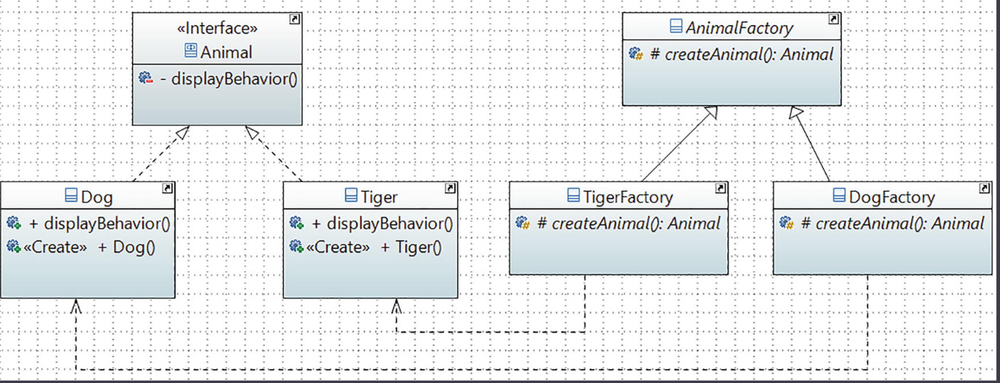

# Patrón de Diseño Factory Method

Este proyecto es una implementación práctica y educativa del patrón de diseño **Factory Method** (Método de Fábrica), uno de los patrones creacionales más importantes definidos por el "Gang of Four" (GoF).

El objetivo principal es demostrar cómo este patrón permite a una clase delegar la responsabilidad de la instanciación de objetos a sus subclases, promoviendo un bajo acoplamiento y cumpliendo con el **Principio Abierto/Cerrado (OCP)**.

## Objetivo del Proyecto

El código de este repositorio sigue una serie de ejercicios progresivos diseñados para:
1.  **Establecer una jerarquía de productos** (la interfaz `Animal` y sus clases concretas).
2.  **Crear una jerarquía de fábricas** (la clase abstracta `AnimalFactory` y sus subclases).
3.  **Implementar el Método de Fábrica** (`createAnimal()`) para delegar la creación de objetos.
4.  **Utilizar un método de plantilla** (`createAndDisplayAnimal()`) en la fábrica abstracta para encapsular lógica común.
5.  **Demostrar el Principio Abierto/Cerrado** al extender el sistema con nuevos productos y fábricas sin modificar el código existente.

---

## Estructura del Proyecto

El proyecto está organizado en dos jerarquías de clases paralelas: una para los **productos** y otra para los **creadores**.


### 1. Jerarquía de Productos (Products)

Define la interfaz para los objetos que el método de fábrica creará.

-   `Animal.java` (Producto Abstracto):
    -   Es una interfaz que define el comportamiento común que todos los productos deben tener (`displayBehavior()`).

-   `Dog.java`, `Tiger.java`, `Lion.java` (Productos Concretos):
    -   Son implementaciones de la interfaz `Animal`. Cada clase proporciona una implementación específica del método `displayBehavior()` y un constructor que confirma su creación.

### 2. Jerarquía de Creadores (Creators)

Define la clase que contiene el método de fábrica y la lógica que depende de los productos.

-   `AnimalFactory.java` (Creador Abstracto):
    -   Es una clase `abstract` que declara el **método de fábrica** abstracto: `protected abstract Animal createAnimal();`.
    -   Contiene lógica de negocio común que no varía, como el método `createAndDisplayAnimal()`, que actúa como un método de plantilla. Este método llama al método de fábrica para crear un producto y luego opera sobre él.

-   `DogFactory.java`, `TigerFactory.java`, `LionFactory.java` (Creadores Concretos):
    -   Son subclases de `AnimalFactory`.
    -   Cada una sobrescribe el método de fábrica `createAnimal()` para devolver una instancia de un producto concreto (`new Dog()`, `new Tiger()`, etc.).

### 3. Cliente (Client)

-   `Main.java`:
    -   Actúa como el cliente del patrón.
    -   El código cliente trabaja con las fábricas a través de la interfaz del creador abstracto (`AnimalFactory`).
    -   Demuestra cómo se puede cambiar la fábrica en tiempo de ejecución para obtener diferentes tipos de productos sin cambiar el código cliente.

---

## ¿Cómo funciona el Patrón Factory Method aquí?

1.  **Delegación de la Creación**: La clase `AnimalFactory` no sabe qué `Animal` concreto crear. Simplemente define un contrato (`createAnimal()`) que sus subclases deben seguir.
2.  **Especialización en Subclases**: Las subclases como `DogFactory` y `TigerFactory` son las que realmente deciden qué objeto instanciar. `DogFactory` siempre crea un `Dog`, y `TigerFactory` siempre crea un `Tiger`.
3.  **Bajo Acoplamiento**: El cliente (`Main`) solo necesita conocer la clase abstracta `AnimalFactory` y la interfaz `Animal`. No está acoplado a las clases concretas (`Dog`, `Tiger`, `Lion`), lo que hace que el sistema sea más flexible.
4.  **Principio Abierto/Cerrado (OCP)**: Como se demuestra en el Ejercicio 5, para añadir un nuevo animal (`Lion`), solo necesitamos crear `Lion.java` y `LionFactory.java`. No es necesario modificar ninguna de las clases existentes. El sistema está **abierto a la extensión** pero **cerrado a la modificación**.

## Cómo Compilar y Ejecutar

Este es un proyecto estándar de Java construido con Maven.

1.  **Compilar el proyecto:**
    ```bash
    mvn compile
    ```
2.  **Ejecutar la clase principal:**
    ```bash
    mvn exec:java -Dexec.mainClass="com.learnpatterns.Main"
    ```

### Salida Esperada

Al ejecutar el programa, la salida en la consola mostrará la secuencia de creación y comportamiento de cada animal, demostrando cómo cada fábrica es utilizada para producir su objeto correspondiente:

```
Initializing client code with DogFactory...
Executing common logic from the abstract factory...
A dog is created.
It says 'woof' and wags its tail.
Common logic finished.
-----------------------------------
Initializing client code with TigerFactory...
Executing common logic from the abstract factory...
A tiger is created.
It roars and hunts.
Common logic finished.
-----------------------------------
Initializing client code with LionFactory...
Executing common logic from the abstract factory...
A lion is created.
It roars majestically and leads the pride.
Common logic finished.
-----------------------------------
```
