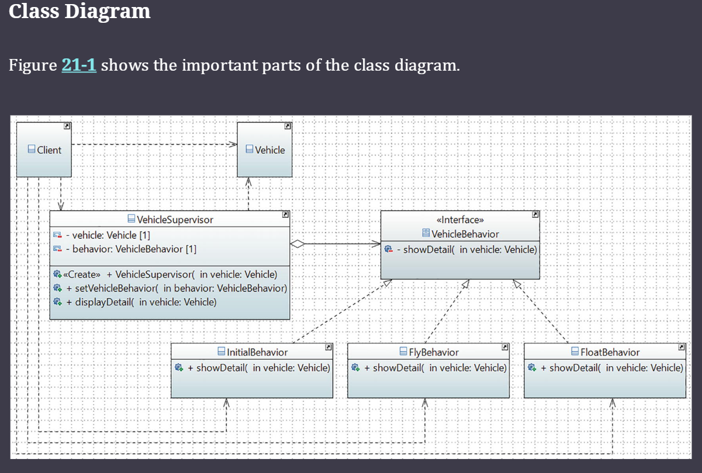

# Proyecto de Demostración del Patrón de Diseño Strategy

Este proyecto es una implementación práctica y educativa del **Patrón de Diseño Strategy** utilizando Java. El objetivo es demostrar cómo este patrón permite definir una familia de algoritmos, encapsular cada uno de ellos y hacerlos intercambiables, permitiendo que el algoritmo varíe independientemente de los clientes que lo utilizan.

## Objetivo de Aprendizaje

El propósito principal de este proyecto es ilustrar los siguientes conceptos clave:

1.  **Encapsulación de Algoritmos**: Cada comportamiento (o estrategia) está contenido en su propia clase.
2.  **Composición sobre Herencia**: El contexto (el `VehicleSupervisor`) mantiene una referencia a una estrategia en lugar de heredar su comportamiento.
3.  **Intercambio Dinámico**: Las estrategias pueden ser cambiadas en tiempo de ejecución, ofreciendo una flexibilidad máxima.
4.  **Principio Abierto/Cerrado (OCP)**: El sistema está abierto a la extensión (se pueden añadir nuevas estrategias) pero cerrado a la modificación (no es necesario cambiar el código del contexto existente).

## Estructura del Proyecto

El código fuente se encuentra en `src/main/java/com/learnpatterns` y está compuesto por los siguientes elementos clave:

### 1. El Contrato de la Estrategia

-   `VehicleBehavior.java`: Es la interfaz que define el contrato común para todas las estrategias. Declara el método `showDetail(Vehicle vehicle)`, que todas las clases de comportamiento deben implementar.

### 2. El Objeto de Dominio

-   `Vehicle.java`: Una clase simple que representa el objeto sobre el cual actúan las estrategias. En este caso, un vehículo con un tipo específico (ej. "Airplane").

### 3. Las Estrategias Concretas

Son las implementaciones específicas de la interfaz `VehicleBehavior`. Cada una encapsula un algoritmo o comportamiento particular:

-   `InitialBehavior.java`: Representa el estado inicial o por defecto de un vehículo.
-   `FlyBehavior.java`: Encapsula la capacidad de volar.
-   `FloatBehavior.java`: Encapsula la capacidad de flotar.
-   `AmphibiousBehavior.java`: Encapsula la doble capacidad de operar en tierra y agua.

### 4. El Contexto

-   `VehicleSupervisor.java`: Es la clase de contexto que gestiona y delega la ejecución a la estrategia actual.
    -   Mantiene una referencia a un objeto `VehicleBehavior`.
    -   Proporciona un método `setVehicleBehavior()` para cambiar la estrategia en tiempo de ejecución.
    -   El método `displayDetail()` delega la llamada a la estrategia actual.

### 5. El Cliente

-   `Main.java`: Actúa como el cliente que utiliza el patrón. Es responsable de:
    1.  Crear el objeto `Vehicle`.
    2.  Crear el `VehicleSupervisor` con una estrategia inicial.
    3.  Demostrar el cambio dinámico de comportamiento llamando a `setVehicleBehavior()` con diferentes estrategias (`FlyBehavior`, `FloatBehavior`, `AmphibiousBehavior`).
    4.  Mostrar cómo se pueden añadir nuevas capacidades sin modificar el supervisor.


## Cómo Ejecutar el Proyecto

Este es un proyecto Maven estándar. Para compilarlo y ejecutarlo, sigue estos pasos:

1.  **Compilar el proyecto**:
    Navega al directorio raíz (`Strategy-Pattern`) y ejecuta el siguiente comando de Maven:
    ```bash
    mvn compile
    ```

2.  **Ejecutar la demostración**:
    Una vez compilado, puedes ejecutar la clase `Main` para ver la salida de la demostración:
    ```bash
    mvn exec:java -Dexec.mainClass="com.learnpatterns.Main"
    ```

### Salida Esperada

Al ejecutar el programa, verás una salida en la consola que demuestra cómo el comportamiento del vehículo cambia dinámicamente:

```
Strategy Pattern - Learning Objective: Dynamically change algorithm at runtime.
--------------------------------------------------------------------------
Current Behavior: Initial
Amphibious Craft is in born state
It cannot do anything special

Changing behavior to FlyBehavior...
Current Behavior: Fly
Amphibious Craft can fly now

Changing behavior to FloatBehavior...
Current Behavior: Float
Amphibious Craft can float now

--- Open/Closed Principle Demonstration ---
Adding a new behavior (Amphibious) without changing the Supervisor...
Current Behavior: Amphibious
Amphibious Craft has dual-capability: it can drive on land and float on water.
--------------------------------------------------------------------------
Demonstration complete. The system was extended with a new behavior without modifying existing context code.
```

Este resultado confirma que el mismo objeto `supervisor` puede ejecutar diferentes comportamientos y que el sistema se puede extender fácilmente con nuevas funcionalidades sin alterar el código existente.
