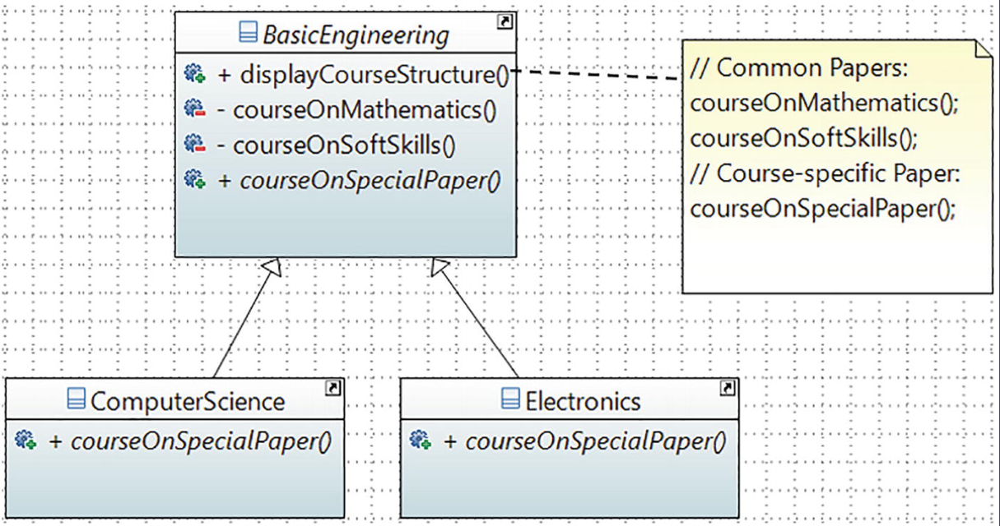

# Patrón de Diseño Template Method en Java

Este proyecto es una implementación detallada y educativa del **Template Method**, un patrón de diseño de comportamiento. Su propósito es definir el esqueleto de un algoritmo en una superclase, permitiendo que las subclases redefinean ciertos pasos de ese algoritmo sin cambiar su estructura general.

Este patrón es fundamental para crear frameworks y es un excelente ejemplo del **Principio de Inversión de Hollywood**: "No nos llames, nosotros te llamaremos". La clase base (plantilla) llama a los métodos de las subclases, y no al revés.

## Problema Abordado: Algoritmos con Pasos Comunes y Variables

Imaginemos que necesitamos definir la estructura de diferentes carreras de ingeniería (Ciencias de la Computación, Electrónica, etc.). Todas las carreras comparten una estructura curricular similar:
1.  Materias troncales (Matemáticas, Habilidades Blandas).
2.  Una materia de especialización (diferente para cada carrera).
3.  Posiblemente, una materia adicional opcional.

Implementar esto sin un patrón llevaría a la **duplicación de código**, ya que la lógica de los pasos comunes se repetiría en cada clase de ingeniería. Además, cualquier cambio en la estructura del curso (por ejemplo, añadir un nuevo paso común) requeriría modificar todas las clases.

## Solución: El Patrón Template Method

El patrón Template Method resuelve este problema de la siguiente manera:
1.  **Define un Esqueleto**: Una clase abstracta (`BasicEngineering`) define un método final, el **método plantilla** (`displayCourseStructure`), que establece la secuencia de pasos del algoritmo.
2.  **Implementa Pasos Comunes**: Los pasos que no varían (`courseOnMathematics`, `courseOnSoftSkills`) se implementan como métodos concretos (y a menudo `private`) en la clase abstracta.
3.  **Difiere Pasos Variables**: Los pasos que varían se declaran como métodos `abstract` (`courseOnSpecialPaper`), forzando a las subclases a proporcionar una implementación.
4.  **Proporciona Ganchos (Hooks)**: Se pueden incluir métodos opcionales con una implementación por defecto (`isAdditionalPaperNeeded`), permitiendo a las subclases "engancharse" al algoritmo para modificar su comportamiento si es necesario.

---

## Estructura del Proyecto

### Componentes Clave

1.  **Abstract Class / Template (`BasicEngineering.java`)**
    -   Contiene el **método plantilla** `displayCourseStructure()`, declarado como `final` para que las subclases no puedan alterar la secuencia del algoritmo.
    -   Implementa los pasos comunes del algoritmo (`courseOnMathematics`, `courseOnSoftSkills`).
    -   Declara los métodos abstractos (`courseOnSpecialPaper`) que las subclases deben implementar.
    -   Incluye un **método de gancho (hook)** `isAdditionalPaperNeeded()` que proporciona un comportamiento por defecto pero puede ser sobrescrito por las subclases para controlar pasos opcionales.

2.  **Concrete Classes (`ComputerScience.java`, `Electronics.java`)**
    -   Extienden la clase abstracta `BasicEngineering`.
    -   `ComputerScience.java`: Proporciona la implementación concreta para `courseOnSpecialPaper()` (e.g., "Object-Oriented Programming") y utiliza el comportamiento por defecto del hook.
    -   `Electronics.java`: Proporciona su propia implementación de `courseOnSpecialPaper()` (e.g., "Digital Logic") y, crucialmente, **sobrescribe el método hook** `isAdditionalPaperNeeded()` para devolver `false`, alterando así el flujo del algoritmo definido en la plantilla.

3.  **Client (`ClientTempPattern.java`)**
    -   El cliente interactúa con las clases concretas a través de la referencia de la clase abstracta.
    -   Simplemente instancia la especialización deseada (`ComputerScience` o `Electronics`) y llama al método plantilla (`displayCourseStructure()`).
    -   El cliente no necesita conocer los detalles del algoritmo; solo sabe que al llamar al método plantilla, se ejecutará el proceso completo y correcto.

## Diagrama de Flujo del Algoritmo



## Beneficios Clave Demostrados

1.  **Reutilización de Código**: La lógica común se escribe una sola vez en la clase base, evitando la duplicación.
2.  **Control Centralizado**: El esqueleto del algoritmo es propiedad de la superclase, que controla el flujo general. Esto reduce los errores y garantiza la consistencia.
3.  **Extensibilidad**: Permite a las subclases especificar comportamientos variables sin cambiar el algoritmo principal, cumpliendo con el Principio Abierto/Cerrado.
4.  **Flexibilidad a través de Hooks**: Los ganchos proporcionan una forma elegante de permitir que las subclases modifiquen el flujo del algoritmo en puntos específicos y opcionales.

## Cómo Compilar y Ejecutar

Este es un proyecto estándar de Java gestionado con Maven.

1.  **Compilar el proyecto:**
    ```bash
    mvn compile
    ```
2.  **Ejecutar la clase principal:**
    ```bash
    mvn exec:java -Dexec.mainClass="com.learnpatterns.ClientTempPattern"
    ```

### Salida Esperada

La salida mostrará claramente cómo el mismo método plantilla produce resultados diferentes según la subclase utilizada, y cómo el hook en `Electronics` modifica el flujo:

```
*** Template Method Pattern Demonstration. ***

Computer Science course structure:
Definiendo la Estructura Base del Curso
1. Mathematics
2. Soft Skills
3. Object-Oriented Programming
4. Compiler construction.

Electronics course structure:
Definiendo la Estructura Base del Curso
1. Mathematics
2. Soft Skills
3. Digital Logic and Circuit Theory.

```
